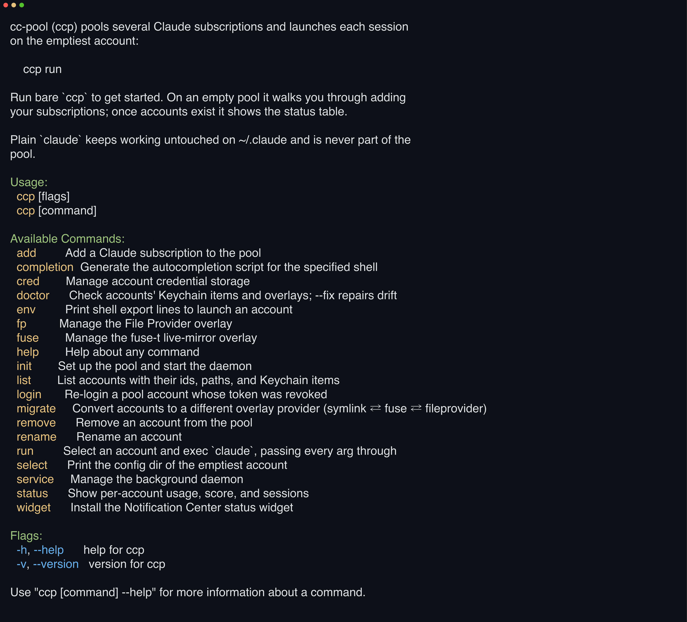

# 

**Make Claude's 5-hour limit your other account's problem.** cc-pool reads live 5-hour and 7-day usage and execs every claude session on the account with the most headroom; no proxy ever touches the request path.

[](https://github.com/yasyf/cc-pool/actions/workflows/ci.yml)
[](https://github.com/yasyf/cc-pool/releases)
[](LICENSE)

## Get started

```sh
brew install yasyf/tap/cc-pool
ccp
```



macOS only; the binary installs as `cc-pool` with a `ccp` symlink. On an empty pool, `ccp` walks you through logging in each subscription, one `claude /login` per account, then offers to wrap `claude` so every session lands on the account with the most headroom.

Driving with an agent? Paste this:

```text
Install cc-pool with `brew install yasyf/tap/cc-pool`, then run `ccp` and walk me through pooling my Claude subscriptions.
Add each account via its own `claude /login` flow and accept the alias so `claude` becomes `ccp run`.
Finish by running `ccp status --plain` and tell me which account my next session will land on and why.
```

---

## Use cases

### Stop hitting the 5-hour limit while another account sits idle

Run two subscriptions and you hit the same wall every week. One account sits pegged at its window while the other holds a week of headroom. With the alias in place, launching is unchanged:

```sh
claude
```

The wrapper announces its pick on stderr, then execs the real `claude`; cc-pool is gone from the process tree before Claude Code draws its first frame (emails normalized):

```text
Selected work@example.com · 5h 22% used · 7d 46% used
```

The alias is `alias claude='ccp run'`, so `command claude` bypasses it whenever you want plain claude on `~/.claude`. To leave `claude` untouched entirely, decline the prompt at onboarding or pass `ccp add --no-alias`, then pick your own name, e.g. `alias cl='ccp run'`.

### See every account's 5-hour and 7-day headroom before you launch

A rate-limit error is a terrible way to learn which account is full. Ask the pool first:

```sh
ccp status --plain
```

```text
  ACCOUNT                     SCORE  5h used  7d used  LIVE RESETS
▸ work@example.com             68.1      22%      46%     0 6:00 PM
  personal@example.com         34.8      61%      70%     0 4:30 PM
▸ = next pick · score higher = emptier
```

On a terminal, `ccp status` renders the same table as a live TUI. When the whole pool is exhausted, `ccp select --wait` blocks until a window frees up; an unforced launch falls back to the least-bad account with a loud stderr warning. That session bills pay-as-you-go credits if extra usage is enabled, or rate-limits until the reset.

### Keep prompt caches warm by pinning a directory to one account

Bouncing a long-running project between accounts throws away its prompt caches on every switch. Repeated launches from one directory already stick to a single account automatically; to force it, pin the directory from the TUI:

```sh
ccp status   # highlight an account, press p to pin the current directory
```

Every launch from that directory then announces `Reusing work@example.com (pinned)` instead of `Selected`, whatever the scores say.

### Run one pool across all your Macs

A second Mac normally means re-running `claude /login` for every subscription, and then the two pools drift apart. Sync mirrors the pool instead:

```sh
brew install yasyf/tap/synckit      # both Macs
synckitd host add user@other-mac    # point each Mac at the other
ccp sync enable                     # both Macs
```

Accounts and credentials now converge: `ccp add` on one Mac materializes the account on the others with no extra login, `ccp remove` propagates pool-wide, and selection counts a peer's live session against an account's score. Each account has one **origin** — the Mac that logged it in — and only the origin refreshes it; the other Macs hold a read-only copy (access token only, no refresh token), so the single-use refresh chain can never be double-spent. When a read-only copy expires, that Mac shows needs-login until the origin's next rotation lands — or run `ccp login` there to make it a second origin. Synced credentials are installed only into the canonical Keychain slot; an unavailable Keychain defers convergence instead of creating a plaintext fallback.

### Glance at the pool without opening a terminal

Headroom you check only at launch time is headroom you discover too late. Put it in Notification Center:

```sh
ccp widget
```

The CLI reconciles the exact signed app from the same cc-pool release into
`~/Applications/CCPoolStatus.app`. It shows per-account 5h/7d usage bars,
live-session counts, and a pool mascot whose mood tracks how fast the pool is
draining. Details in [widget/README.md](widget/README.md).


## Commands

| Command | What it does |
|---|---|
| `ccp` | Guided onboarding on an empty pool, the status table once accounts exist, and shorthand for `ccp run` when given flags |
| `ccp add` | Pool a subscription via its own `claude /login`; auto-inits the pool and starts the daemon |
| `ccp run [claude args…]` | Select the emptiest account and exec `claude`, forwarding every arg |
| `ccp status` | Per-account usage, score, and sessions; TUI on a terminal, plain table when piped |
| `ccp select` | Inspect and print the daemon-prepared best account without creating a session; launch only with `ccp run` |
| `ccp sync` | Mirror the pool — accounts, credentials, removals — across Macs on a synckit mesh |
| `ccp doctor` | Check accounts' Keychain items and File Provider presentations; `--fix` repairs drift |
| `ccp service` | Manage the daemon and signed `CCPoolStatus.app` via `install`, `uninstall`, and `status` |

Run `ccp help <command>` for every flag and the rest of the surface, which covers `env`, `list`, `login`, `rename`, `remove`, `init`, `cred`, `widget`, and `daemon`.

## How it works

`~/.claude` is **never touched**. Plain `claude` keeps working and can't be logged out by the pool. Secrets live only in the macOS Keychain, never in cc-pool's database. Selection is **predictive**. It scores each account's live 5h/7d usage before launch and picks the emptiest, instead of waiting for a rate-limit error to tell you the pick was wrong. [docs/ARCHITECTURE.md](docs/ARCHITECTURE.md) covers the full design, from per-account config dirs and revisioned File Provider presentation to the scoring formula and the daemon.

## Uninstall

```sh
ccp service uninstall            # stop the daemon + CCPoolStatus app services
                                 # (refuses under live sessions; --force overrides)
ccp service uninstall --purge    # ...and remove all pool accounts/dirs/state
brew uninstall cc-pool
```

Licensed under [PolyForm Noncommercial 1.0.0](LICENSE), free for noncommercial use.
