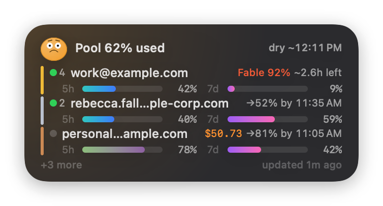

# cc-pool status and filesystem host

A macOS WidgetKit widget that shows `ccp status` at a glance: per-account 5h/7d
usage bars, live-session counts, and flags (stale / rate-limited / exhausted /
overage), in the same order as the CLI's table.



## How it gets data

The daemon writes an atomic snapshot to `~/.cc-pool/status.json` after every
completed poll (~3 min) — same schema as `ccp status --json`. The sandboxed
widget extension reads that file via a read-only sandbox exception for
`~/.cc-pool/`; it never touches the socket, the database, or the Keychain.

The fixed signed `/Applications/CCPoolStatus.app` also embeds the FuseKit runtime and
File Provider broker. Its one Mach-O dispatches authenticated service roles before
SwiftUI startup, owns the ordinary FuseKit socket below `~/.cc-pool/fusekit`, and owns
the App Group socket used by `CCPoolFileProvider.appex`. The Go account daemon
never names or traverses the Group Container.

In normal app mode it registers the widget, launches at login, watches
`~/.cc-pool` for status updates, runs the runtime, and brokers File Provider
catalog traffic. The File Provider extension has no direct home-directory
exception.

## Install

```sh
ccp widget
```

That installs the prebuilt app from the `cc-pool-status` Homebrew cask (the
release build is Developer ID signed, notarized, and stapled, so a normal
install passes Gatekeeper), launches it once so macOS discovers the widget, and
prints the enable steps:

Open Notification Center (click the menu-bar clock), scroll down →
**Edit Widgets** → search "cc-pool" → add the small, medium, or large widget. Desktop
widgets work too: right-click the desktop → Edit Widgets.

If the widget doesn't appear in the gallery: `killall NotificationCenter
chronod`, relaunch the app, and re-open the gallery.

To remove it: `brew uninstall --cask cc-pool-status`.

## Build from source (development)

Requires full Xcode, the Go version from `go.mod`, and
[XcodeGen](https://github.com/yonaskolb/XcodeGen) (`brew install xcodegen`).

```sh
cd widget
printf 'MARKETING_VERSION = 0.0.0\nCURRENT_PROJECT_VERSION = 1\n' > Version.xcconfig
xcodegen generate
# macOS caches widget metadata by bundle version — bump it every build or the
# gallery keeps a stale descriptor. Epoch seconds is unique per build (commit
# count, used in CI, wouldn't change across uncommitted rebuilds).
xcodebuild -project CCPoolStatus.xcodeproj -scheme CCPoolStatus \
  -configuration Debug -derivedDataPath build build test \
  CODE_SIGN_STYLE=Manual CODE_SIGN_IDENTITY="-" \
  CURRENT_PROJECT_VERSION=$(date +%s)
```

This is a compile/unit-test build only. Do not copy it over the production app
or exercise File Provider, TCC, or worker-kill behavior on the
host; use `scripts/vm/vmctl push` and the disposable VM scenarios for every live
signed-runtime test.

`project.yml` is the source of truth; the `.xcodeproj` and everything under
`Generated/` are emitted by xcodegen and gitignored. To work in the Xcode UI:
`xcodegen generate && open CCPoolStatus.xcodeproj`.

## Regenerating the docs screenshot

`docs/assets/widget-medium.png` (used above and in the main README) is rendered
from the `PoolStatus.sample` fixture — never captured from a live widget — so
it's reproducible and shows no real account data:

```sh
./scripts/render-screenshot.sh
```

Re-run it whenever the widget UI changes. It needs only the Xcode toolchain
(`xcrun swiftc`), not xcodegen or xcodebuild.

## Signing

Release builds (CI) are **Developer ID signed, notarized, and stapled**, so the
cask installs and launches under Gatekeeper with no quarantine workaround — see
the widget-app step in `.github/workflows/release.yml`.

The fixed signed host embeds the File Provider-only FuseKit runtime in its one
Mach-O and never disables library validation. No native filesystem runtime or
system extension is installed.

Ad-hoc signing is sufficient only for pure unit tests. File Provider and TCC
verification require the exact Developer ID application identity and App Group
profiles used by the release:

```sh
xcodebuild -project CCPoolStatus.xcodeproj -scheme CCPoolStatus \
  -configuration Release -derivedDataPath build build \
  CODE_SIGN_STYLE=Manual DEVELOPMENT_TEAM=SXKCTF23Q2 \
  CODE_SIGN_IDENTITY="Developer ID Application" \
  ENABLE_HARDENED_RUNTIME=YES
```

## Troubleshooting

- `codesign -d --entitlements - /Applications/CCPoolStatus.app/Contents/PlugIns/CCPoolStatusWidget.appex`
  must show `com.apple.security.app-sandbox` plus the
  `temporary-exception.files.home-relative-path.read-only` entry for `/.cc-pool/`.
- `log stream --predicate 'process == "chronod" OR process CONTAINS "CCPoolStatusWidget"'`
  shows widget discovery/launch errors.
- "daemon not running" in the widget → `ccp service install`; "status
  unreadable" → version skew between
  the snapshot and the widget — rebuild the widget or update cc-pool, and check
  `ccp status --json`.
- `codesign -d --entitlements - /Applications/CCPoolStatus.app` and the File
  Provider appex must both contain `SXKCTF23Q2.ccp`; the appex must contain no
  home-relative file exception.
- `nm -gU /Applications/CCPoolStatus.app/Contents/MacOS/CCPoolStatus` must show
  `_CCPoolFuseKitDispatchChild`, `_CCPoolFuseKitStart`, `_CCPoolFuseKitReady`,
  `_CCPoolFuseKitWait`, and `_CCPoolFuseKitStop`, proving worker dispatch and
  exact runtime settlement are in the same signed Mach-O.
